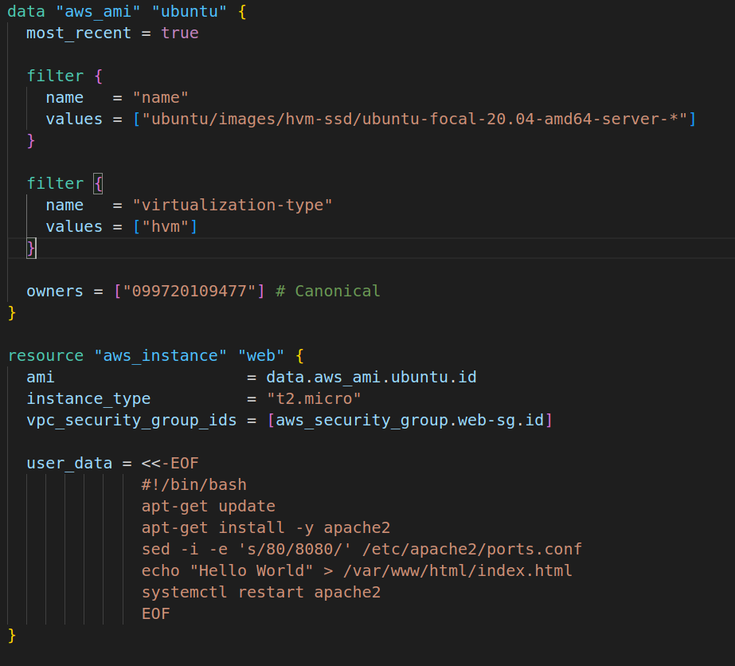
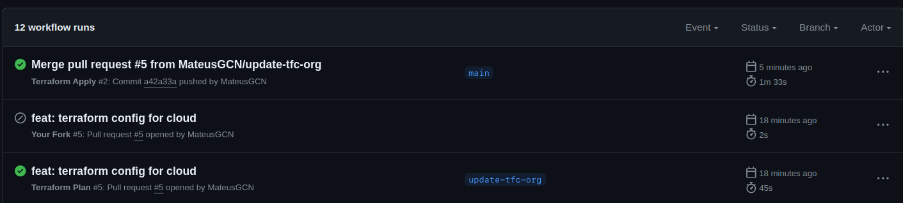
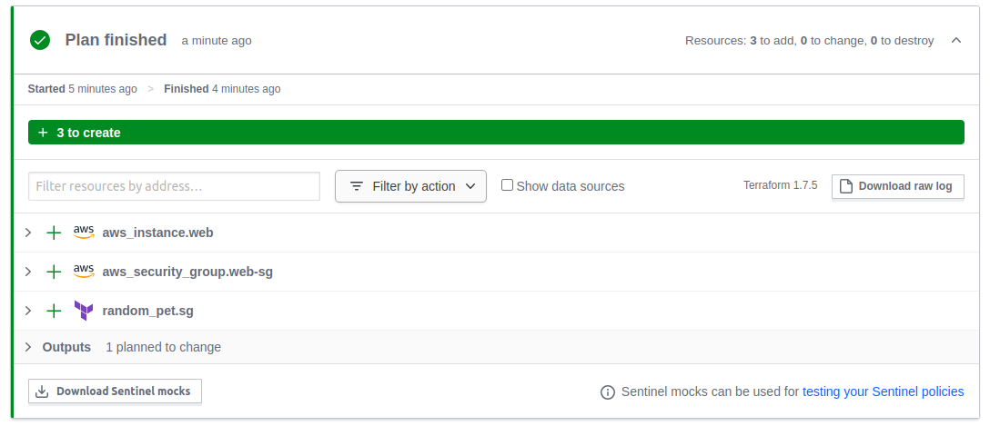
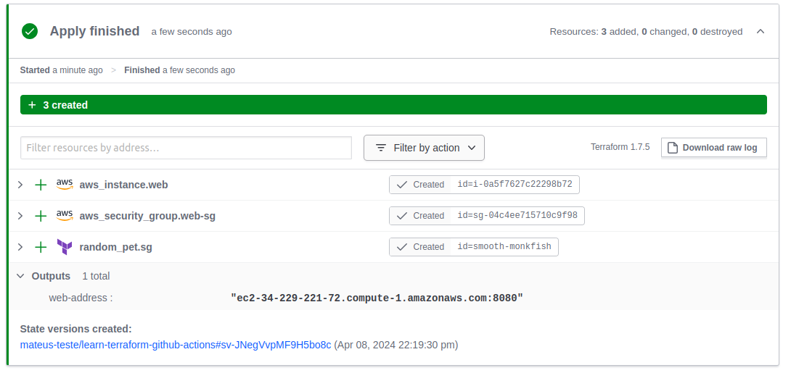
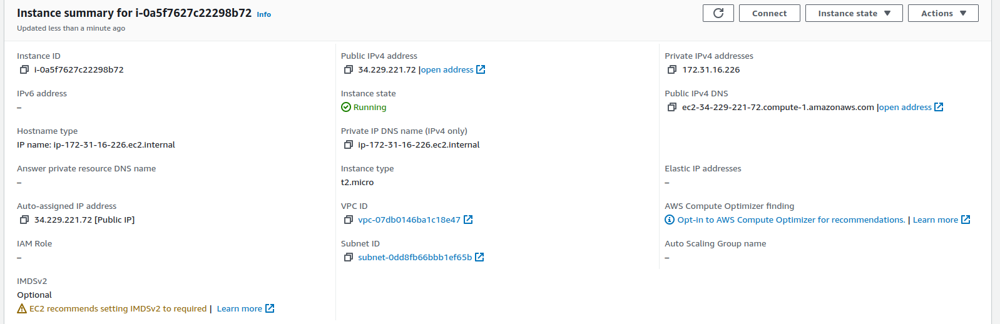
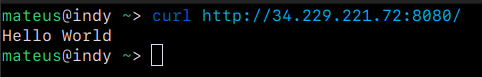

# Automação com GitHub Actions e Terraform

## Introdução
Este relatório apresenta o uso de GitHub Actions junto com o Terraform para a criação e gestão de infraestrutura na AWS. A integração dessas ferramentas facilita a implementação de práticas de Infraestrutura como Código, essenciais para a automação de processos em ambientes de cloud computing.

## Tecnologia Utilizada
- **GitHub Actions**: Ferramenta de CI/CD integrada ao GitHub que automatiza workflows.
- **Terraform**: Ferramenta que permite provisionar e gerenciar infraestrutura utilizando código.

## Conceitos Aprendidos
- **Infraestrutura como Código**: Prática que envolve o gerenciamento de infraestrutura através de arquivos de configuração.
- **Automatização de Pipeline**: Implementação de pipelines de CI/CD para automatizar testes e implantação de código em cloud computing.
- **Gerenciamento do Terraform**: Uso de backends remotos para gerenciar o estado do Terraform, permitindo rastrear e compartilhar o estado da infraestrutura.

## Configuração e Execução

### Código do Terraform
O código Terraform cria uma instância EC2 na AWS, especificando tipo de instância e configurações de rede.

#### Print do Código

### GitHub Actions Workflow
O workflow configurado no GitHub Actions é responsável por iniciar o Terraform para aplicar as mudanças na infraestrutura sempre que uma alteração é feita na branch Main.

#### Print do Workflow no GitHub Actions

#### Print do Terraform Plan

#### Print do Terraform Apply

## Componentes Criados na Nuvem
Foi criada uma instância EC2 na AWS como parte do processo de automação.

### Print da Instância EC2

## Teste da aplicação criada na Instância
Com o workflow concluido uma aplicação foi criada dentro da Instância EC2, sua função é retornar "Hello World" na porta 8080 da Instância.

## Conclusão
A integração entre GitHub Actions e Terraform é uma solução para automação da criação e gestão de infraestrutura na nuvem, promovendo uma maior eficiência, escalabilidade e reduzindo a possibilidade de erros.

This repo is a companion repo to the [Automate Terraform with GitHub Actions tutorial](https://developer.hashicorp.com/terraform/tutorials/automation/github-actions).
